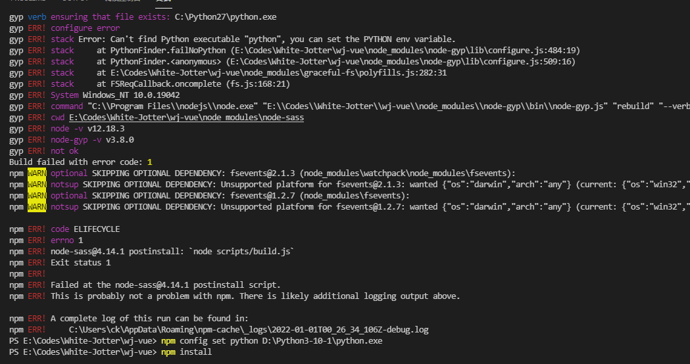

# 项目npm install过程中报错，解决记录

## 错误1 

解决npm install时报错无法安装chromedriver的问题
https://blog.51cto.com/zero01/2298070

**运行下面的命令**

npm install --ignore-scripts 

## 错误2

详细解决方案：**Node Sass does not yet support your current environment: OS X 64-bit with Unsupported runtime**
https://blog.csdn.net/qq_41788977/article/details/109822271

```
#先卸载node-sass
npm uninstall node-sass
#再重装4.x版本的node-sass
npm install node-sass@4.14.1
```

## 错误三



1. 安装python
2. 查看Python安装路径
3. `npm config set python D:\Python3-10-1\python.exe`